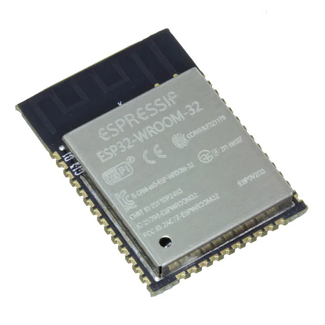
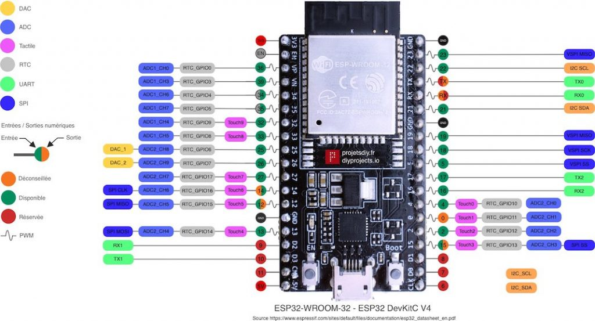

# Om ESP32

ESP32 er en serie billige, mikrobrikkere med integrert Wi-Fi og Bluetooth.  De bruker lite strøm og tar liten plass.

ESP32 er designet av Espressif Systems, et Shanghai-basert kinesisk selskap, og er produsert av TSMC ved bruk av deres 40 nm-prosess. Den er en etterfølger til ESP8266 mikrokontrolleren.

ESP32 og ESP8266 er veldig populære til prototyping på grunn av deres lave pris, enkelhet i bruk, dokumentasjon og tilgjengelighet til informasjon på nettet.

En ESP32 er ca. på størrelsen med en negl og inneholder det meste man trenger for å lage en IoT- enhet:



Slike chipper kalles ofte System on a Chip (SoC) fordi de inneholder alle de viktigste komponentene til en datamaskin, slik som:
 - prosessor
 - minne
 - støtteprosessorer (dvale, kryptering m.m.)
 - trådløse kommunikasjonsgrensesnitt (WiFi og Bluetooth)
 - trådbaserte kommunikasjonsgrensesnitt (SPI, RS232, I2C)

For å gjøre det enklere å bruke chippen for prototyping settes den ofte på såkalte development boards:


Det finnes mange forskjellige typer development boards fra mange forskjellige produsenter. Disse har forskjellige inkluderte enheter og størrelser. For eksempel, har noen tilkoblet kamera, og andre har tilkoblet batterier e.l.  

## Språk og utviklingsmiljøer

Det er mulig å benytte flere ulike språk, men C++ er mest vanlig. Per Buer fra Knowit har laget et introkurs i micropython på ESP32 som du kan se på [youtube](https://www.youtube.com/watch?v=VxN0Ps51OJU&t=1413s).

De mest populære C++ - plattformene er:
 - [Arduino](https://github.com/espressif/arduino-esp32) - Som er det enkleste å bruke og det som vi skal bruke i dette kurset.
 - [ESP-IDF](https://docs.espressif.com/projects/esp-idf/en/latest/esp32/get-started/) - Som er en plattform spesialutviklet for ESP32 og sopm best utnytter chippen. Dette rammeverket krever litt mer innsats. Vi kommer ikke til å bruke den plattformen i dette kurset.

## Spenningsnivå

ESP32 bruker 3.3V som driftsspenning.

Utviklingsbrettene har ofte en inkludert spenningsregulator som gjør at det kan drives med opptil 14V. Uansett vil ESP32 kun operere på 3.3V, og vil bli ødelagt dersom den får høy spenning fra f.eks en sensor.

Driftspenningen begrenser valg av eksterne enheter som sensorer. Før du bruker en sensor, sjekk at den kan jobbe på 3.3V driftspenning.

Arduino-brett bruker 5V, så vær oppmerksom på dette dersom du ønsker å følge eksempler på nettet som er basert på den spenningen. 

## Funksjoner
* CPU: Xtensa dual-core (eller single-core) 32-bit LX6 microprocessor, på 160 eller 240 MHz.
* Ultra low power (ULP) co-processor
* Minne: 320 KiB RAM, 448 KiB ROM og mulighet for å bruke ekstra minne.
* Wi-Fi: 802.11 b/g/n
* Bluetooth: v4.2 BR/EDR og BLE (deler radio med Wi-Fi)
* Integrerte enheter, bl.a
    * 34 × programmerbare GPIOs (innganger og utganger)
    * 12-bit ADC på opptil 18 kanaler (analoge innganger)
    * 2 × 8-bit DACs (analoge utganger)
    * 10 × touch sensorer (kapasitive sensorer)
    * 4 × SPI (serieporter for tilkobling av eksterne enheter)
    * 2 × I²S interfaces (grensesnitt for digital lyd)
    * 2 × I²C interfaces (serieporter for tilkobling av eksterne enheter)
    * 3 × UART (enheter for seriell kommunikasjon)
    * SD/SDIO/CE-ATA/MMC/eMMC host controller (for tilkobling av minnenheter)
    * Ethernet MAC interface
    * CAN bus 2.0
    * PWM for styring av motorer og LEDs
* Integrerte sikkerhetmekaniser, bl.a. 
    * IEEE 802.11 standard inkludert WPA, WPA2, WPA3 og WAPI
    * Sikker boot
    * Kryptering av flash
    * Hardwareaksellerert kryptering: AES, SHA-2, RSA, m.m.
* Støtte for lavt strømforbruk

## Pins

ESP32 har mange innganger og utganger. Enkelte av disse har mange moduser, mens enkelte har begrensninger. Noen av pinnene er veldig spesifikke brukes til
å gi strøm til andre enheter eller for å 
boote enheten.

Pins som kan har mange bruksområder kalles som oftes General Purpose Input Output (GPIO). Disse har har mange bruksområder. Hva de skal brukes til
settes av programvaren i chippen.

Eksempel på bruksområder for GPIOer:
- lese av verdier fra analoge sensorer (f.eks temperatursensor)
- kommunisere med digitale sensorer (f.eks GPS)
- kommunisere med andre mikrokontrollere
- touch-sensorer (merker om de blir berørt)
- digitale utganger (f.eks skru av eller på en LED/ lampe)
- digitale utganger med PWM (f.eks dimme en LED/ lampe)

Dette er to enkle eksempler som viser oppsett av to pins, en som inngang (pin 32) og en som utgang (pin 34):

```cpp
pinMode(32, INPUT);
pinMode(34, OUTPUT);
```

Følgende diagram viser såkalt pinout av ESP32 (hva de ulike pins kan brukes til):




Kilde: [diyprojects.io](https://diyprojects.io/)
