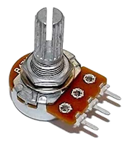
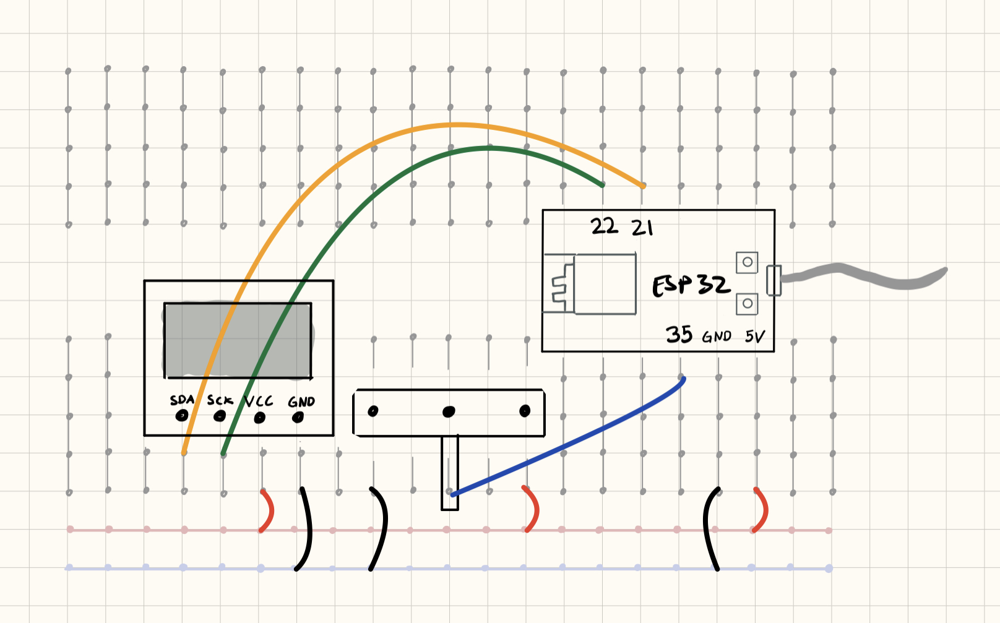
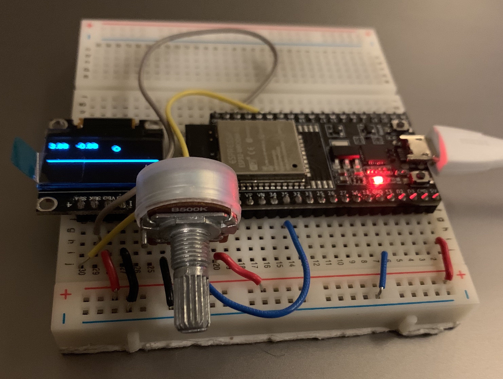
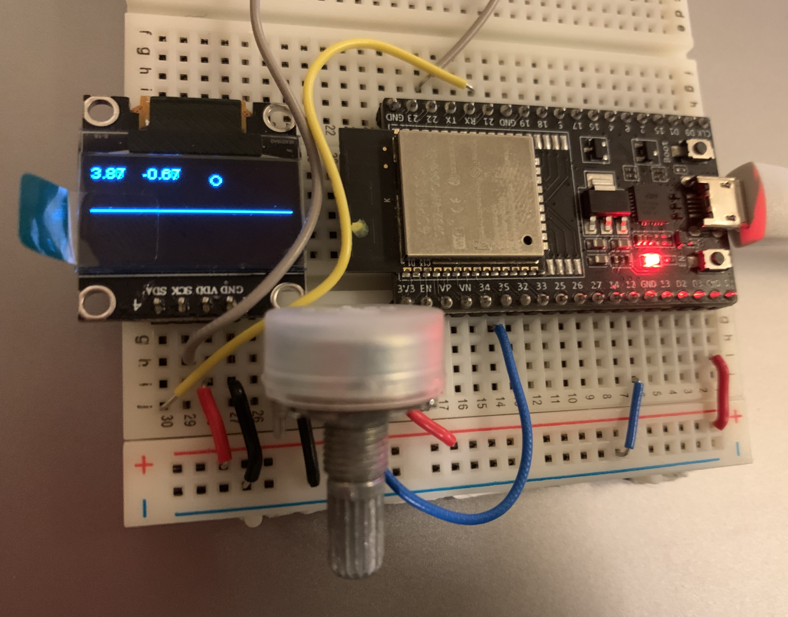
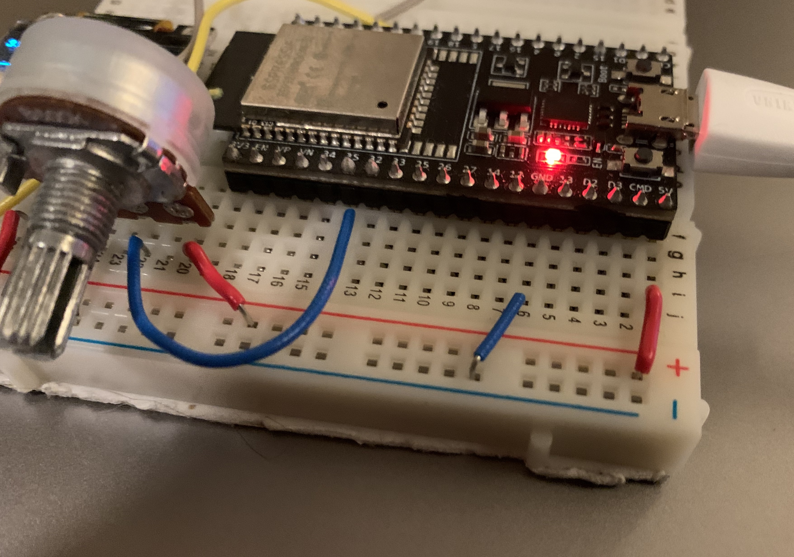
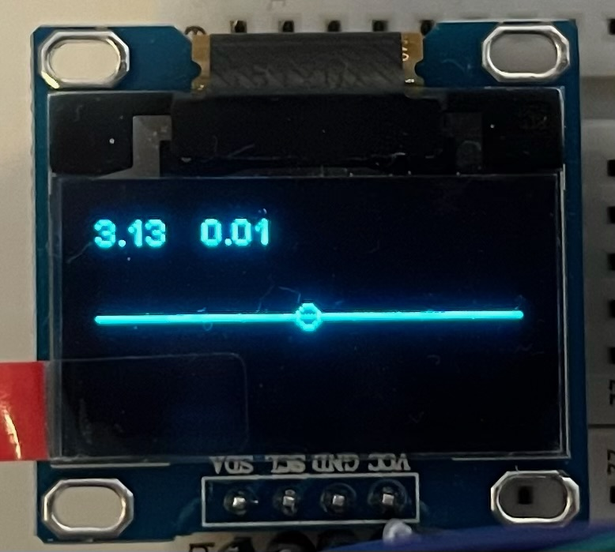
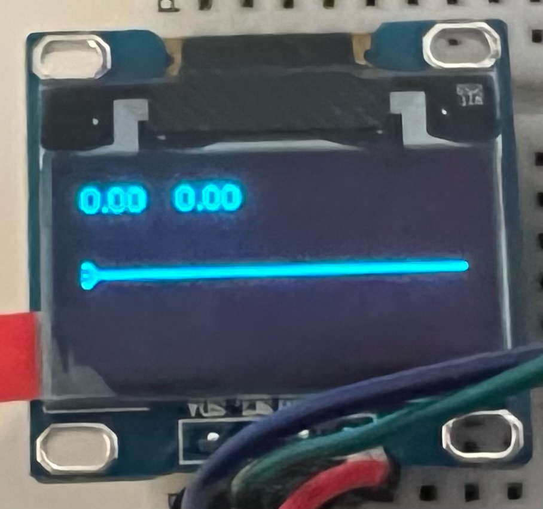

## I2C OLED

__VIKTIG:__ Denne leksjonen byggere videre på [Les potmeter](../LesPotmeter/README.md)

I denne leksjonen ser vi på hvordan ESP32 kan kommunisere med eksterne enheter over synkron seriekommunikasjon ([I2C](https://en.wikipedia.org/wiki/I%C2%B2C))

### Funksjonalitet

ESP32-en leser av potmeteret og bruker verdiene til å tegne tekst og grafikk på en OLED skjerm

### Du trenger

| Type          | Antall           | Kommentar  |  Utseende  |
| ------------- | :------------- |:-----| :----: |
| Potmeter	| 1 | | 
| 128x64 I2C OLED Display| 1 | | 
| Breadboard (prototypebrett)	| 1 | | 
| ESP32 | 1 | | 


### Konstruksjon







### I2C OLED Driver
For å lett kunne sende kommandoer til OLED displayet trenger vi en driver. Med Platform.io er dette veldig enkelt, vi trenger bare legge en til som en ekstern avhengighet: `lib_deps = thingpulse/ESP8266 and ESP32 OLED driver for SSD1306 displays@^4.2.1`

Full `platformio.ini` fil:
```
[env:esp32dev]
platform = espressif32
board = esp32dev
framework = arduino
monitor_speed = 115200

; Eksternt bibliotek med driveren vi trenger 
lib_deps = thingpulse/ESP8266 and ESP32 OLED driver for SSD1306 displays@^4.2.1
```

### Program

Legg inn følgende program:

```
#include "Arduino.h"
#include <Wire.h>               // Only needed for Arduino 1.6.5 and earlier
#include "SSD1306Wire.h"        // legacy: #include "SSD1306.h"
#include <math.h>

#define POTMETER_PIN 35
#define SCREEN_WIDTH 128
#define SCREEN_HEIGHT 64

constexpr float MAX_X = 2.0f*PI;

SSD1306Wire display(0x3c, SDA, SCL);

void setup() {
    pinMode(POTMETER_PIN, INPUT);    
    display.init();
}

void loop() {
    display.clear();

    auto x = ((float)analogRead(POTMETER_PIN)/4095.0f)*MAX_X;
    auto y = sinf(x);

    display.setTextAlignment(TEXT_ALIGN_LEFT);
    display.setFont(ArialMT_Plain_10);
    display.drawString(0, 0, String(x));
    display.drawString(32, 0, String(y));

    display.drawCircle((int)floor(x/MAX_X*SCREEN_WIDTH), (int)floor((y*0.5f+0.5f)*SCREEN_HEIGHT), 3);
    display.drawLine(0, SCREEN_HEIGHT/2, SCREEN_WIDTH, SCREEN_HEIGHT/2);

    display.display();

    delay(100);   
}
```

Når programmet er lastet opp og kjører, vrir du på potmeteret og ser `x` og `y` verdien skrevet på skjermen, samt en sirkel som følger sinuskurven mellom `0` og `2*PI`:






