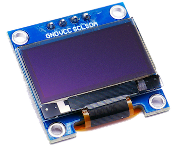
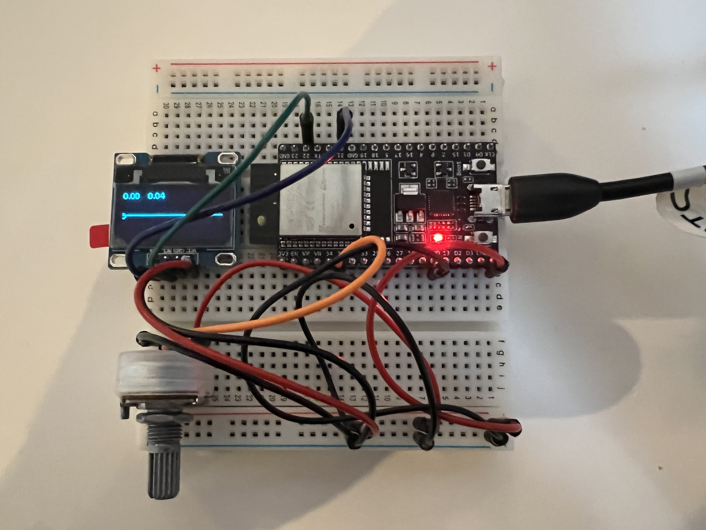

## Nevralt nettverk inferens

Denne leksjonen bygger videre på [I2C OLED](../I2COLED/README.md)

**TODO: intro tekst**

### Funksjonalitet

ESP32-en leser av potmeteret og bruker veridene som inndata i ett nevralt nett 

### Du trenger

| Type          | Antall           | Kommentar  |  Utseeende |
| ------------- | :------------- |:-----| :----: |
| Potmeter	| 1 | | 
| 128x64 I2C OLED Display| 1 | | 
| Breadboard (prototypebrett)	| 1 | | 
| ESP32 | 1 | | 


### Konstruksjon

**TODO: koblingsdiagram og finere bilder**



### I2C OLED Driver og Tensorflow Lite
For å lett kunne sende kommandoer til OLED displayet trenger vi en driver. Med Platform.io er dette veldig enkelt, vi trenger bare legge en til som en ekstern avhengighet: `thingpulse/ESP8266 and ESP32 OLED driver for SSD1306 displays@^4.2.1`

I tilegg trenger vi også en versjon av Tensorflow Lite for mikrokontrollere konfigurert for ESP32 med Arduino Framework: `https://github.com/tcirstea/Arduino_TensorFlowLite_ESP32.git` (Dette er en kopi av https://github.com/tensorflow/tflite-micro konfigurert for platform.io, arduino og ESP32)

Full `platformio.ini` fil:
```
[env:esp32dev]
build_flags = -DTF_LITE_USE_GLOBAL_MIN -DTF_LITE_USE_GLOBAL_MAX
platform = espressif32
board = esp32dev
framework = arduino
monitor_speed = 115200
lib_deps = 
	thingpulse/ESP8266 and ESP32 OLED driver for SSD1306 displays@^4.2.1
	https://github.com/tcirstea/Arduino_TensorFlowLite_ESP32.git

```

### Tensorflow Lite Modell for Mikrokontrollere
For hele prosessen se [oppskrift her](./TreneModell.md)

[Last ned](./model.zip) ferdig tent modell. Zip-filen inneholder disse filene:
```
sin_model/
    assets/
    variables/
    saved_model.pb
    keras_metadata.pb
sin_model.cc
sin_model.tflite
sin_model_quantization_params.json
```

`sin_model`-mappen er Tensorflow/Keras modellen og `sin_model.tflite` er samme modell konvertert til en optimalisert Tensorflow Lite modell

`sin_model.cc` er en hexdump av `sin_model.tflite` laget ved hjelp av verktøyet: https://www.tutorialspoint.com/unix_commands/xxd.htm. Det er denne filen vi bruker for å få modellen vår inn på mikrokontrolleren 

`sin_model_quantization_params.json` inneholder kvantiserings-parametere for å konvertere inn- og ut-data i modellen mellom heltall og flyttall 

### Program

Kopier `sin_model.cc` inn i `src/` mappen og lag en header-fil (`sin_model.h`) for den i `include/` mappen:
```
#pragma once

extern unsigned char sin_model_tflite[];
extern unsigned int sin_model_tflite_len;
```

Legg inn følgende program:

```
#include "Arduino.h"
#include <Wire.h>               // Only needed for Arduino 1.6.5 and earlier
#include "SSD1306Wire.h"        // legacy: #include "SSD1306.h"
#include <math.h>
#include "sin_model.h"

#undef DEFAULT // Fordi Arduino er teit
#include "tensorflow/lite/micro/all_ops_resolver.h"
#include "tensorflow/lite/micro/micro_error_reporter.h"
#include "tensorflow/lite/micro/micro_interpreter.h"
#include "tensorflow/lite/schema/schema_generated.h"
#include "tensorflow/lite/version.h"

#define POTMETER_PIN 35
#define SCREEN_WIDTH 128
#define SCREEN_HEIGHT 64

#define INPUT_SCALE 0.024573976173996925
#define INPUT_ZERO_POINT -128

#define OUTPUT_SCALE 0.00804501585662365
#define OUTPUT_ZERO_POINT -1

constexpr float MAX_X = 2.0f*PI;

SSD1306Wire display(0x3c, SDA, SCL);


tflite::MicroErrorReporter micro_error_reporter;
tflite::AllOpsResolver resolver;
const tflite::Model* model;
tflite::MicroInterpreter* interpreter;

constexpr int kTensorArenaSize = 64*1024;
static uint8_t tensor_arena[kTensorArenaSize];


void setup_nn_inference() {

    model = tflite::GetModel(sin_model_tflite);
    if (model->version() != TFLITE_SCHEMA_VERSION) {
        Serial.println("Wrong model schema version");
        return;
    }

    static tflite::MicroInterpreter static_interpreter(model, resolver, tensor_arena, kTensorArenaSize, &micro_error_reporter);
    interpreter = &static_interpreter;

    if (interpreter->AllocateTensors() != kTfLiteOk) {
        Serial.println("Tensor alloc failed");
        return;
    }
}

void setup() {
    Serial.begin(115200);    
    pinMode(POTMETER_PIN, INPUT);    
    display.init();
    setup_nn_inference();
}

int8_t quantize(float data) {
    return static_cast<int8_t>(static_cast<int>(data / INPUT_SCALE) + INPUT_ZERO_POINT);
}

float dequantize(int8_t quantized_data) {
    return static_cast<float>(quantized_data - OUTPUT_ZERO_POINT) * OUTPUT_SCALE;
}

float nn_sinf(float x) {
    
    // quantize input
    auto input = interpreter->input(0);
    *input->data.int8 = quantize(x);

    // Invoke TF lite interpreter
    auto invoke_status = interpreter->Invoke();
    if (invoke_status != kTfLiteOk) {
        Serial.println("invoke failed");
    }

    // Dequantize output
    auto output = interpreter->output(0);
    auto pred = dequantize(output->data.int8[0]);

    return pred;
}

void loop() {
    display.clear();

    auto x = ((float)analogRead(POTMETER_PIN)/4095.0f)*MAX_X;
    auto y = nn_sinf(x); // Nevralt nett utgaven av sinf

    display.setTextAlignment(TEXT_ALIGN_LEFT);
    display.setFont(ArialMT_Plain_10);
    display.drawString(0, 0, String(x));
    display.drawString(32, 0, String(y));

    display.drawCircle((int)floor(x/MAX_X*SCREEN_WIDTH), (int)floor((y*0.5f+0.5f)*SCREEN_HEIGHT), 3);
    display.drawLine(0, SCREEN_HEIGHT/2, SCREEN_WIDTH, SCREEN_HEIGHT/2);

    display.display();

    delay(100);   
}
```

Pass på at konstantene `INPUT_SCALE`, `INPUT_ZERO_POINT`, `OUTPUT_SCALE` og `OUTPUT_ZERO_POINT` stemmer med de som er definert i `sin_model_quantization_params.json`

Når programmet er lastet opp og kjører, vrir du på potmeteret og ser `x` og `y` verdien skrevet på skjermen, samt en sirkel som følger sinuskurven mellom `0` og `2*PI`:


